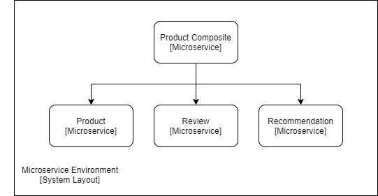
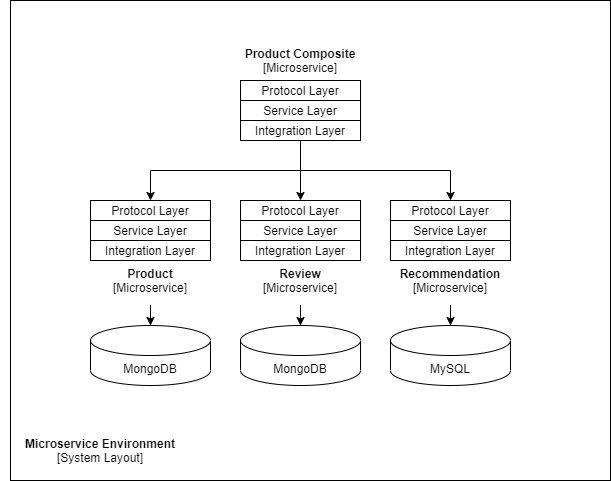
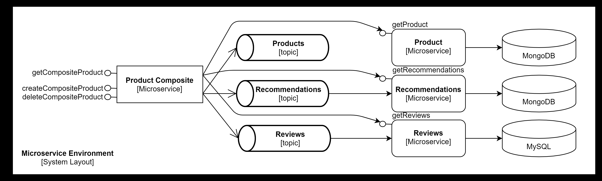

### 스프링 부트와 스프링 클라우드로 만드는 마이크로서비스 셋

#### `API`와 `메시지` 기반의 `비동기` 서비스를 모두 지원하는 `리액티브` 마이크로서비스를 만들었습니다.

#### 구성

- `스프링 빈`을 기반으로 하는 비지니스 로직 구현
- `스프링 웹플럭스`를 기반으로 하는 REST API 구현 (`논블록킹` `동기` REST API 포함)
- `스프링 클라우드 스트림`을 사용한 `메시지` 기반의 `비동기` 서비스 구현 
- `스프링 폭스`와 `스웨거`/`OpenAPI`를 사용한 REST API 문서화
- `스프링 데이터`를 사용한 SQL/NoSQL 데이터베이스 구축

#### 사용한 기술

- `스프링 부트`
- `스프링 웹플럭스`
- `스프링 폭스`
- `스프링 데이터`
- `스프링 클라우드 스트림`
- `도커`

#### 개발 환경을 위한 필요 도구

- `Git`
- `Java`
- `curl`
- `jq`
- `Spring Boot CLI`

#### 사용한 개발 도구
- `MapStruct` 자바 빈 매핑 도구, 스프링 데이터 엔티티 객체와 API 모델 클래스 상호 변환

#### 마이크로서비스 구조

- 마이크로서비스 구조

</img> 

- 영속성 추가

</img> 

- 논블로킹 동기 REST API

</img> 